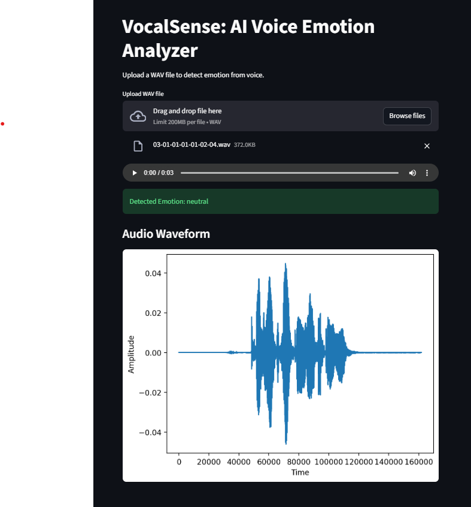

# VocalSense: AI Voice Emotion Analyzer

## Project Overview
This project detects human emotions from voice recordings using machine learning and audio signal processing.

## Technologies Used
- Python
- Librosa
- Scikit-learn
- Streamlit

## Features
- Extracts MFCC audio features
- Trains a Random Forest classifier
- Detects emotions from speech
- Interactive web interface

## Application Demo



## How to Run

1. Install dependencies

```
pip install -r requirements.txt
```

2. Train model

```
python train_model.py
```

3. Run application

```
streamlit run app.py
```

## Author
Roshni Anand
Vellore Institute of Technology
